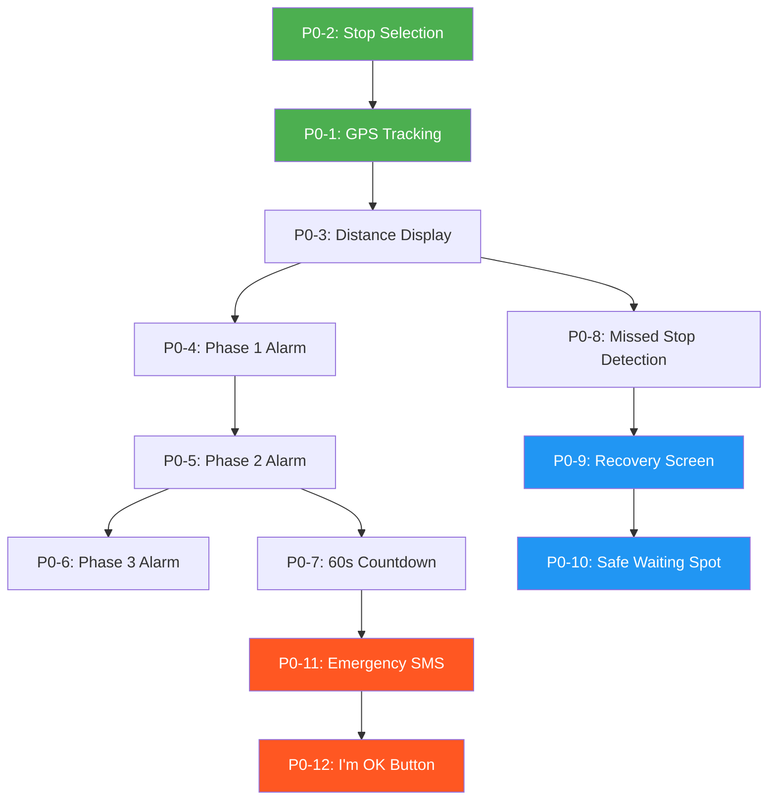
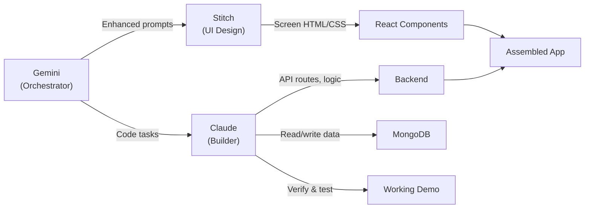

# PLAN.md — Nudge Master Plan

> **Status**: DRAFT — Awaiting human review and approval  
> **Last updated**: 2026-03-28

---

## 1. Product Summary

**Nudge** is a personal safety companion for vulnerable transit commuters. It does three things:

1. **Wake Her Up** — Escalating alarm before her stop
2. **Get Her Home** — Rerouting + safe spot if she misses it
3. **Keep Her Safe** — SMS/call alerts to emergency contacts

### The User — Maria
- 34, domestic worker in Manila
- Finishes 12-hour shifts, rides 2 buses home after midnight
- Low-end Android phone, limited data
- Misses her stop 2–3× per month
- Can't afford a $45 rideshare. Can't safely wait alone on a dark street.

### Demo Format
Pre-recorded video walkthrough of the full Nudge flow, played during the live presentation. The video will demonstrate:
- Real GPS tracking and distance updates
- All three alarm phases escalating on a real device
- A missed stop triggering the recovery screen
- A real SMS arriving on a second phone
- The "I'm OK" button sending a resolution message

---

## 2. Feature List by Priority Tier

### P0 — Demo Blockers (Must work perfectly in the video)

| # | Feature | Pillar | Description |
|---|---------|--------|-------------|
| P0-1 | GPS tracking | Wake | `watchPosition()` with high accuracy, live distance to stop via Haversine |
| P0-2 | Stop selection | Wake | Search/select destination stop, save coordinates |
| P0-3 | Distance display | Wake | Live km/minutes remaining on journey screen |
| P0-4 | Phase 1 alarm | Wake | Vibration pattern at 5 min / ~1km from stop |
| P0-5 | Phase 2 alarm | Wake | Loud alarm sound (Web Audio API) + continuous vibration at 200m |
| P0-6 | Phase 3 alarm | Wake | Voice shouting via SpeechSynthesis every 4.5s, full brightness |
| P0-7 | 60-second countdown | Wake | Visible countdown before family alert fires |
| P0-8 | Missed stop detection | Recovery | Detect when user passes 500m+ beyond destination |
| P0-9 | Recovery screen | Recovery | Show rerouting instructions with transit steps |
| P0-10 | Safe waiting spot | Recovery | Find nearest 24h venue (McDonald's, hospital, convenience store) |
| P0-11 | Emergency SMS | Safety | Twilio SMS with name, missed stop, timestamp, map link |
| P0-12 | I'm OK button | Safety | Cancel all alarms, send resolution SMS |
| P0-13 | Screen flow | All | All 8 screens navigable and functional |
| P0-14 | Mobile device test | All | Runs on real Android Chrome without crashing |

### P1 — Build Immediately After P0

| # | Feature | Pillar | Description |
|---|---------|--------|-------------|
| P1-1 | Screen wake lock | Wake | `navigator.wakeLock.request('screen')` during monitoring |
| P1-2 | Dead reckoning | Wake | Accelerometer fallback when GPS is unreliable |
| P1-3 | Emergency voice call | Safety | Twilio Voice call 30s after SMS with TTS message |
| P1-4 | Live location link | Safety | 30-min shareable location URL in SMS |
| P1-5 | Rideshare deep-link | Recovery | One-tap Uber/Grab with destination pre-filled |
| P1-6 | Multilingual voice | Wake | SpeechSynthesis in Filipino, Hindi, Swahili, Portuguese |
| P1-7 | Google Maps deep-link | Recovery | One-tap open full route in Google Maps |

### P2 — Only If P0 + P1 Are Solid

| # | Feature | Pillar | Description |
|---|---------|--------|-------------|
| P2-1 | UI polish & animations | All | Glassmorphism, micro-animations, premium feel |
| P2-2 | Battery saver mode | Wake | Reduce GPS frequency below 15% battery |
| P2-3 | Repeated miss detection | Recovery | Suggest route change after 3 misses on same stop |
| P2-4 | Caregiver dashboard | Safety | Family monitors elderly relative's journey |
| P2-5 | Community safety map | Recovery | Crowdsourced reports of unsafe stops |
| P2-6 | Panic button | Safety | Manual SOS separate from missed stop flow |
| P2-7 | Onboarding flow | UX | Language selector, permission requests, 3-tap setup |

---

## 3. Dependency Graph (Build Order)



**Critical path**: Stop Selection → GPS → Distance → Alarms → Missed Stop → Recovery → SMS → I'm OK

---

## 4. Risk Register

| # | Risk | Likelihood | Impact | Mitigation |
|---|------|-----------|--------|------------|
| R1 | GPS inaccurate indoors/urban canyons | High | High | Use `enableHighAccuracy: true`, implement dead reckoning fallback (P1-2), allow manual "I'm near my stop" override |
| R2 | Browser blocks audio without user gesture | High | Critical | Require explicit "Start Monitoring" tap which also unlocks AudioContext. Re-unlock on visibility change |
| R3 | Twilio trial only sends to verified numbers | High | Medium | Pre-verify demo numbers. Budget $10 for paid upgrade if needed |
| R4 | `watchPosition` stops in background | High | High | Screen Wake Lock (P1-1) keeps app foregrounded. For video demo, keep phone screen visible |
| R5 | SpeechSynthesis voice unavailable | Medium | Medium | Bundle fallback alarm audio file. Test on demo device beforehand |
| R6 | Google Maps/Places API rate limits | Low | High | Cache rerouting results. Use hardcoded fallback data for demo |
| R7 | Network failure during demo video | Medium | Critical | Pre-cache API responses. Have offline fallback paths for recovery screen |
| R8 | SMS delivery delay | Medium | High | Send SMS early in the countdown. For demo, pre-test timing with exact numbers |
| R9 | Phone overheats from continuous GPS | Low | Medium | Lower GPS frequency after initial lock. 90-second demo window is short enough |
| R10 | Service Worker conflicts with live GPS | Low | Medium | Keep Service Worker minimal — cache static assets only |
| R11 | Stitch-generated UI doesn't match mobile viewport | Medium | Medium | Test all Stitch screens on 375px viewport. Manually adjust CSS if needed |
| R12 | MongoDB connection latency from frontend | Low | Medium | All P0 features work client-side. MongoDB stores journey logs, not real-time state |

---

## 5. Demo Script (90 Seconds)

> This is the sequence for the pre-recorded video demo.

| Time | Action | What Audience Sees |
|------|--------|--------------------|
| 0:00–0:10 | Open Nudge on phone. Show landing screen. | Clean app with tagline: "Sleep on your commute. We'll make sure you get off at the right stop." |
| 0:10–0:20 | Set destination stop. Show emergency contact. Tap "Start Monitoring". | Stop name appears, contact visible, monitoring begins |
| 0:20–0:35 | Journey active screen. Distance counting down in real time. GPS indicator green. | Live distance display: "2.1 km → 1.4 km → 0.8 km" |
| 0:35–0:40 | Phase 1 triggers. Screen turns yellow. Gentle vibration. | "Wake up soon" message. Subtle pulse |
| 0:40–0:50 | Phase 2 triggers. Loud alarm sound. Screen goes red. 60-second countdown starts. | Full-screen red takeover. "YOUR STOP" heading. Countdown: 60…55…50… |
| 0:50–0:55 | Presenter does NOT respond. Countdown hits 0. | Countdown reaches zero. "Alerting your emergency contacts…" |
| 0:55–1:05 | Phase 3 fires. Voice shouts "PLEASE WAKE UP". SMS fires simultaneously. | Voice shouting from phone. Cut to second device where SMS arrives with name, stop, map link |
| 1:05–1:15 | Show the SMS on second phone. Tap the map link — live location loads. | Audience sees real SMS with real map link showing the user's location |
| 1:15–1:20 | Switch back to main phone. Recovery screen visible with reroute + safe spot. | Route instructions, safe venue card, Google Maps button |
| 1:20–1:25 | Tap "I'M OK" button. | Giant button press, all alarms stop |
| 1:25–1:30 | Show second phone — resolution SMS arrives. | "Maria has confirmed she is safe." |

**Total: 90 seconds. One person protected, recovered, and brought home safely.**

---

## 6. Agentic AI Orchestration Plan

This build uses multiple AI agents, each with a specific role:

### Agent Roles

| Agent | Role | Tooling |
|-------|------|---------|
| **Gemini (Orchestrator)** | Oversees the entire build. Feeds prompts to Stitch and Claude. Makes architectural decisions. Reviews all outputs. | Antigravity + Gemini 3.1 Pro via Stitch MCP |
| **Google Stitch (UI Designer)** | Generates all 8 screens as pixel-perfect mobile UI. Uses Stitch MCP tools for screen generation, design systems, and editing. | Stitch MCP server (`generate_screen_from_text`, `edit_screens`, `create_design_system`) |
| **Claude (Builder)** | Writes all backend code, API integrations, GPS logic, alarm system, Twilio integration, and state management. Handles code verification and testing. | Claude Code extension with file access |
| **MongoDB (Data Layer)** | Stores journey logs, emergency contacts, transit stop data, safe venue cache. | MongoDB MCP server |

### Stitch Skills to Install

From the [stitch-skills repo](https://github.com/google-labs-code/stitch-skills):

1. **`stitch-design`** — Unified entry point for design work. Handles prompt enhancement and design system synthesis
2. **`stitch-loop`** — Generates complete multi-page website from prompts with automated file organization
3. **`enhance-prompt`** — Transforms vague UI ideas into polished Stitch-optimized prompts
4. **`react-components`** — Converts Stitch screens to React components (if using React)
5. **`design-md`** — Generates DESIGN.md documenting the design system

```bash
# Install skills globally
npx skills add google-labs-code/stitch-skills --skill stitch-design --global
npx skills add google-labs-code/stitch-skills --skill stitch-loop --global
npx skills add google-labs-code/stitch-skills --skill enhance-prompt --global
npx skills add google-labs-code/stitch-skills --skill react-components --global
npx skills add google-labs-code/stitch-skills --skill design-md --global
```

### Workflow



### How It Works in Practice

1. **Gemini** reads each task from TASKS.md
2. For UI tasks: Gemini crafts an enhanced prompt using `enhance-prompt` skill, then calls `generate_screen_from_text` via Stitch MCP
3. For code tasks: Gemini formulates the task clearly and passes it to Claude Code for implementation
4. For data tasks: Claude writes MongoDB schemas and seed data via the MongoDB MCP
5. After each task: Gemini reviews the output against requirements, requests corrections if needed
6. Claude handles all verification — running the dev server, testing flows, checking SMS delivery

---

## 7. Success Criteria

- [ ] App installs and runs on a real device without crashing
- [ ] Alarm escalates correctly through all three phases on a live test journey
- [ ] Missed stop detection triggers recovery screen with real data
- [ ] Recovery screen shows rerouting, safe spot, and rideshare option
- [ ] Emergency SMS fires to a real phone with correct content
- [ ] I'm OK cancels all alerts and sends resolution message
- [ ] Full 90-second demo video runs without a single failure
- [ ] Video is polished enough for a live presentation to judges

---

## 8. Known Limitations (Judge-Ready Answers)

| Limitation | Honest Answer |
|------------|---------------|
| **iOS background restrictions** | iOS Safari suspends background tabs aggressively. Screen Wake Lock API and Service Worker help significantly. A native iOS app would have deeper background access — that's the production path. |
| **Twilio trial restrictions** | Trial accounts can only SMS/call verified numbers. $10 upgrade covers hundreds of messages for production. |
| **Dead reckoning drift** | Accelerometer-based position estimation drifts over time. In tunnels under 5 minutes, this is acceptable. We don't claim centimetre accuracy — we claim "close enough to know you're still moving toward your stop." |
| **GPS accuracy in dense urban areas** | Urban canyon effect can reduce accuracy to 50–100m. We use this as a feature: our alarm triggers at 200m precisely because GPS isn't perfect. We build safety margins into every threshold. |
| **Data usage** | Continuous GPS + occasional API calls. On a limited data plan (~2MB/journey), this is manageable. Safe spot and reroute data can be pre-cached. |

---

## 9. Open Questions for Human

> [!IMPORTANT]
> **Please review and respond to these before we proceed to STACK.md:**

1. **Framework preference**: I'm leaning toward **Next.js** (full-stack, API routes for Twilio, deploys easily to Vercel). Are you comfortable with React/Next.js, or do you prefer something else?

2. **Twilio account status**: Do you already have a Twilio account? Trial or paid? We need Account SID, Auth Token, and a phone number.

3. **Google Maps API key**: Do you have a Google Cloud project with Maps JavaScript API, Directions API, and Places API enabled?

4. **Demo video recording**: How are you planning to record the demo video? Screen mirroring + phone camera? OBS? A tool like Scrcpy for Android mirroring?

5. **Target device**: What exact phone model and browser will you use for the demo video? (Need this for testing)

6. **Emergency contact numbers**: For the demo video, what phone numbers should receive the test SMS? (Need to verify them on Twilio if trial)

7. **Transit stops**: What city/route should the demo simulate? Manila bus system? We need to pick a real route for realistic stop names and coordinates.

8. **Timeline**: How many days do we have before the presentation?
