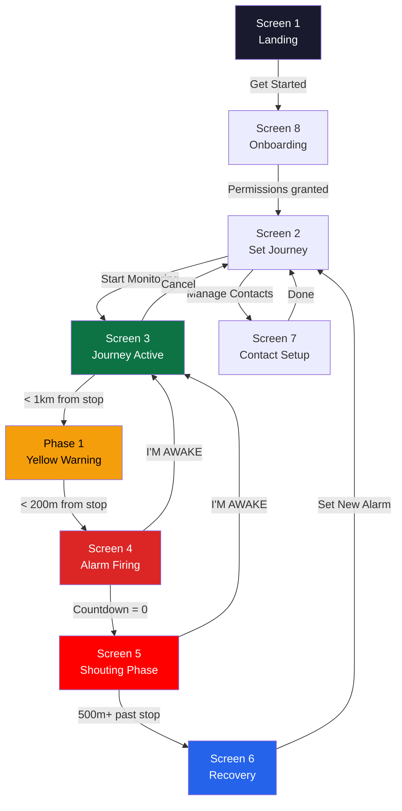

# SCREENS.md — Screen-by-Screen UX Plan

> **Status**: DRAFT — Awaiting human review and approval  
> **Last updated**: 2026-03-28  
> **Target**: Mobile-first PWA, tested on real Android phones (Chrome)  
> **Viewport**: 375px width (standard mobile), full-height

---

## Screen Navigation Map



---

## Global Design Specs

| Property | Value |
|----------|-------|
| **Font** | Inter (Google Fonts) — clean, modern, excellent mobile readability |
| **Base font size** | 16px body, 14px secondary |
| **Color palette** | Dark navy base (`#0a0a1a`), accent green (`#00d4aa`), alarm red (`#ff2d2d`), warning yellow (`#f59e0b`), recovery blue (`#3b82f6`) |
| **Corner radius** | 12px cards, 24px buttons, 50% status indicators |
| **Button min height** | 56px (touch-friendly, exceeds 48px minimum) |
| **Spacing scale** | 4px base: 8, 12, 16, 24, 32, 48 |
| **Safe areas** | `env(safe-area-inset-*)` for notched phones |
| **Status bar** | Dark theme (`<meta name="theme-color" content="#0a0a1a">`) |

---

## Screen 1 — Landing

### Purpose
First impression. Communicate what Nudge does in 3 seconds. One CTA.

### Layout (top to bottom)

```
┌─────────────────────────┐
│                         │
│      [Nudge Logo]       │  ← App icon, centered
│                         │
│   "Sleep on your        │  ← h1, 28px, white
│    commute."            │
│                         │
│   "We'll make sure you  │  ← h2, 18px, muted
│    get off at the       │
│    right stop."         │
│                         │
│   ─────────────────     │
│                         │
│   ✓ Wake you before     │  ← Feature bullets
│     your stop           │    with icons
│                         │
│   ✓ Get you home if     │
│     you miss it         │
│                         │
│   ✓ Alert someone       │
│     who cares           │
│                         │
│   ✓ Works offline       │
│                         │
│                         │
│  ┌───────────────────┐  │
│  │   Get Started →   │  │  ← Primary CTA, 56px tall
│  └───────────────────┘  │    Accent green (#00d4aa)
│                         │
│    Already set up?      │  ← Text link → /journey/setup
│    Start a journey      │
│                         │
└─────────────────────────┘
```

### Interactions
- **"Get Started"** → navigates to `/onboarding` (first time) or `/journey/setup` (returning)
- Subtle gradient background: `#0a0a1a` → `#0d1b2a`
- Logo has a gentle breathing animation (scale 1.0 → 1.02 → 1.0, 3s loop)

### Stitch Prompt
> "Mobile landing screen for a personal safety app called Nudge. Dark navy background (#0a0a1a). Centered logo at top. Large heading 'Sleep on your commute.' with subheading 'We'll make sure you get off at the right stop.' Four feature bullets with green checkmark icons. Large green call-to-action button 'Get Started' at bottom. Minimalist, premium, modern."

---

## Screen 2 — Set Journey

### Purpose
Select destination stop + set emergency contacts. One-tap to start monitoring.

### Layout

```
┌─────────────────────────┐
│ ← Back         Nudge    │  ← Header
│─────────────────────────│
│                         │
│  Where are you going?   │  ← Section title, 20px
│                         │
│  ┌─ 🚌 Bus ─┬─ 🚆 Train─┐ │  ← Transit mode toggle
│  └──────────┴───────────┘ │
│                         │
│  ┌───────────────────┐  │
│  │ 🔍 Search stop...  │  │  ← Search input, 52px
│  └───────────────────┘  │
│                         │
│  ┌───────────────────┐  │  ← Autocomplete results
│  │ 📍 Baclaran Stn   │  │    appear here
│  │ 📍 EDSA Station   │  │
│  │ 📍 Taft Avenue    │  │
│  └───────────────────┘  │
│                         │
│  ┌─────────────────────┐│
│  │ ✅ Baclaran Station ││  ← Selected stop card
│  │ LRT-1 · End of line ││    with confirm state
│  └─────────────────────┘│
│                         │
│─────────────────────────│
│                         │
│  Emergency Contacts     │  ← Section title
│  (Strongly recommended) │  ← Muted subtitle
│                         │
│  ┌─────────────────────┐│
│  │ 👤 Ate Rosa         ││  ← Contact card
│  │ +639171234567  [✕]  ││
│  └─────────────────────┘│
│  ┌─────────────────────┐│
│  │ + Add Contact       ││  ← Add button
│  └─────────────────────┘│
│                         │
│  ┌───────────────────┐  │
│  │ 🛡️ Start           │  │  ← Primary CTA
│  │   Monitoring       │  │    Disabled until stop selected
│  └───────────────────┘  │    Green when active
│                         │
└─────────────────────────┘
```

### Interactions
- **Stop search**: Client-side filter against pre-loaded `stops.json` from MongoDB. Debounced, shows top 5 matches.
- **Transit toggle**: Filters stops by Bus or Train
- **Contact card**: Tap to edit, [✕] to remove. Max 3 contacts.
- **"+ Add Contact"** → inline form or navigate to `/contacts`
- **"Start Monitoring"** → disabled (gray) until stop is selected. Turns green when ready.
- Tapping "Start Monitoring" simultaneously:
  1. Requests location permission (if not already granted)
  2. Unlocks AudioContext (required for alarm sounds)
  3. Requests Screen Wake Lock
  4. Navigates to `/journey/active`

---

## Screen 3 — Journey Active (Monitoring)

### Purpose
Reassure user that monitoring is active. Show live distance. Stay calm and minimal until alarm triggers.

### Layout

```
┌─────────────────────────┐
│ ● GPS Active    Nudge   │  ← Green dot = GPS active
│─────────────────────────│    Yellow dot = dead reckoning
│                         │    Red dot = no signal
│                         │
│       Going to          │  ← 14px, muted
│                         │
│    Baclaran Station     │  ← 24px, white, bold
│                         │
│                         │
│     ┌─────────────┐    │
│     │             │    │
│     │   2.1 km    │    │  ← Large distance display
│     │             │    │    48px, centered
│     │  ~8 min     │    │  ← ETA below, 20px, muted
│     │             │    │
│     └─────────────┘    │  ← Circular card with
│                         │    subtle glow animation
│                         │
│    ┌────────────────┐   │
│    │ ~~~~~~~~~~~~   │   │  ← Animated pulse bar
│    │   Monitoring   │   │    Shows "alive" state
│    │    active      │   │
│    └────────────────┘   │
│                         │
│                         │
│                         │
│                         │
│                         │
│      [ Cancel Trip ]    │  ← Small text button, bottom
│                         │
└─────────────────────────┘
```

### Phase 1 Warning State (distance < 1km)
The screen **transitions** without navigating — same page, different visual state:

```
┌─────────────────────────┐
│ ● GPS Active    Nudge   │
│─────────────────────────│  ← Background shifts to
│                         │    warm amber gradient
│       Wake Up Soon      │  ← Yellow text, 20px
│                         │
│    Baclaran Station     │
│                         │
│     ┌─────────────┐    │
│     │             │    │
│     │   340 m     │    │  ← Distance pulses yellow
│     │             │    │
│     │  ~1 min     │    │
│     │             │    │
│     └─────────────┘    │  ← Card border turns yellow
│                         │    Subtle pulse animation
│                         │
│  ┌───────────────────┐  │
│  │  I'M AWAKE —      │  │  ← Dismiss button appears
│  │  GOT IT           │  │    in Phase 1
│  └───────────────────┘  │
│                         │
│      [ Cancel Trip ]    │
│                         │
└─────────────────────────┘
```

### Interactions
- Distance updates every GPS callback (~1-3 seconds)
- **Phase 1 trigger** (1km): background amber, vibration starts, "Wake Up Soon" text appears
- **Phase 2 trigger** (200m): navigate to `/alarm/warning`
- **Cancel**: stop tracking, release wake lock, return to `/journey/setup`

---

## Screen 4 — Alarm Firing (Full-Screen Takeover)

### Purpose
WAKE THE USER UP. Nothing subtle. Nothing missable. Full-screen red, loud alarm, giant button.

### Layout

```
┌─────────────────────────┐
│                         │
│                         │  ← Full-screen RED
│                         │    background (#ff2d2d)
│                         │    Pulsing opacity animation
│                         │
│      ⚠️  YOUR STOP      │  ← 36px, white, bold
│                         │
│    Baclaran Station     │  ← 24px, white
│                         │
│                         │
│     ┌─────────────┐    │
│     │             │    │
│     │     47      │    │  ← Countdown, 72px
│     │   seconds   │    │    Pulses faster < 10s
│     │             │    │    Color shifts to
│     └─────────────┘    │    bright white < 10s
│                         │
│   Your emergency        │  ← 14px, white/80%
│   contacts will be      │
│   alerted when this     │
│   reaches zero          │
│                         │
│  ┌───────────────────┐  │
│  │                   │  │
│  │   I'M AWAKE —     │  │  ← GIANT button, 72px tall
│  │   DISMISS         │  │    White bg, red text
│  │                   │  │    Impossible to miss
│  └───────────────────┘  │
│                         │
└─────────────────────────┘
```

### Interactions
- **Alarm sound**: Web Audio API square wave oscillator at 880Hz, pulsing on/off every 500ms
- **Vibration**: Continuous pattern `[500, 200, 500, 200]` on loop
- **Countdown**: 60 → 0 at 1/second. Under 10s, text pulses red→white rapidly
- **"I'M AWAKE"**: Stops all alarms, stops countdown, navigates back to `/journey/active` with monitoring paused
- **Countdown hits 0**: Navigate to `/alarm/shouting`, trigger SMS send
- **Accidental dismiss prevention**: Require a **press-and-hold (1 second)** or **double-tap** to dismiss. Single accidental tap doesn't dismiss.

### Stitch Prompt
> "Full-screen alarm takeover for a mobile safety app. Solid red background (#ff2d2d) with subtle pulsing glow. Large warning icon at top. 'YOUR STOP' in 36px bold white. Stop name below. Giant countdown number (72px) in the center showing '47 seconds'. Small text explaining contacts will be alerted. Massive white dismiss button at bottom reading 'I'M AWAKE — DISMISS'. No navigation, no distractions. Everything is designed to wake someone up. Mobile viewport 375px."

---

## Screen 5 — Shouting Phase (Full Screen)

### Purpose
Maximum escalation. The user has not responded for 60 seconds. Voice shouting. Contacts being alerted. Visual desperation.

### Layout

```
┌─────────────────────────┐
│                         │  ← BRIGHT RED (#ff0000)
│                         │    Entire screen PULSES
│                         │    between red and white
│                         │    every 1 second
│                         │
│                         │
│     PLEASE              │  ← 48px, white, bold
│     WAKE UP             │    Shaking animation
│                         │
│                         │
│  ┌─────────────────────┐│
│  │ ✉️ Your emergency    ││  ← Alert banner
│  │ contacts have been   ││    White bg, red border
│  │ notified             ││
│  └─────────────────────┘│
│                         │
│                         │
│                         │
│  ┌───────────────────┐  │
│  │                   │  │
│  │                   │  │
│  │    I'M AWAKE      │  │  ← EVEN LARGER button
│  │                   │  │    80px tall, full width
│  │                   │  │    White bg, red text
│  │                   │  │
│  └───────────────────┘  │
│                         │
└─────────────────────────┘
```

### Interactions
- **SpeechSynthesis**: Shouts "PLEASE WAKE UP. YOU ARE PASSING YOUR STOP." every 4.5 seconds
- **SMS has fired**: Banner confirms contacts were alerted
- **"I'M AWAKE"** tap:
  1. Stops voice shouting
  2. Stops alarm sound
  3. Stops vibration
  4. Sends resolution SMS to contacts ("Maria is safe")
  5. Navigates to `/recovery` if missed stop detected, or back to `/journey/active`
- **30 seconds after SMS (P1)**: Automated voice call fires to contacts

---

## Screen 6 — Missed Stop Recovery

### Purpose
The user is awake but past their stop. Guide them home safely. Never leave them stranded.

### Layout

```
┌─────────────────────────┐
│ ← Back          Nudge   │
│─────────────────────────│
│                         │
│  ┌─────────────────────┐│  ← Alert banner, blue bg
│  │ ✉️ Emergency contact ││
│  │ has been notified    ││
│  └─────────────────────┘│
│                         │
│  Missed Your Stop 😔    │  ← 24px heading
│  Don't worry — we'll    │  ← 16px, muted
│  get you home.          │
│                         │
│  ┌─────────────────────┐│
│  │ 📍 Your destination  ││  ← Destination reminder
│  │ Baclaran Station     ││    card
│  └─────────────────────┘│
│                         │
│  ┌─────────────────────┐│
│  │ 🗺️ Getting Back      ││  ← Route card
│  │                      ││
│  │ Total: ~18 min       ││
│  │                      ││
│  │ 1. Walk 3 min to     ││  ← Step-by-step
│  │    Gil Puyat Stn     ││    instructions
│  │                      ││
│  │ 2. Take LRT-1        ││
│  │    southbound         ││
│  │    → 4 stops          ││
│  │                      ││
│  │ 3. Exit at            ││
│  │    Baclaran Station   ││
│  │                      ││
│  │ ┌──────────────────┐ ││
│  │ │ 🗺️ Open in Maps  │ ││  ← Deep-link button
│  │ └──────────────────┘ ││
│  └─────────────────────┘│
│                         │
│  ┌─────────────────────┐│
│  │ 🏪 Safe Spot Nearby  ││  ← Safe venue card
│  │                      ││
│  │ McDonald's Taft Ave  ││
│  │ 📍 120m · 2 min walk ││
│  │ 🟢 Open 24 hours     ││
│  │                      ││
│  │ ┌──────────────────┐ ││
│  │ │ 🚶 Walk There    │ ││  ← Deep-link to Maps
│  │ └──────────────────┘ ││
│  └─────────────────────┘│
│                         │
│  ┌─────────────────────┐│
│  │ 🚗 Get a Ride        ││  ← Rideshare card (P1)
│  │                      ││
│  │ No more buses tonight?││
│  │ ┌──────────────────┐ ││
│  │ │ Open Grab →      │ ││  ← Deep-link to Grab/Uber
│  │ └──────────────────┘ ││
│  └─────────────────────┘│
│                         │
│  ┌───────────────────┐  │
│  │ 🔔 Set New Alarm   │  │  ← CTA → /journey/setup
│  └───────────────────┘  │
│                         │
│  ┌───────────────────┐  │
│  │ ✅ I'M OK          │  │  ← Green, always visible
│  └───────────────────┘  │    Sends resolution SMS
│                         │
└─────────────────────────┘
```

### Interactions
- **Page loads with loading state** while fetching directions and safe spots from API
- **Route card**: Fetched from Google Directions API (transit mode)
- **Safe spot**: Fetched from Google Places API (types: `restaurant`, `gas_station`, `hospital`, `convenience_store`, filtered for open now)
- **"Open in Maps"**: `https://www.google.com/maps/dir/?api=1&origin=LAT,LNG&destination=LAT,LNG&travelmode=transit`
- **"Open Grab"**: `grab://open?destination=LAT,LNG` or fallback to `https://grab.com`
- **"I'M OK"**: Sends resolution SMS, navigates to confirmation state
- **Scrollable**: This is the longest screen. Content overflows viewport — native scroll.

---

## Screen 7 — Emergency Contact Setup

### Purpose
Add emergency contacts who will be alerted if user misses their stop.

### Layout

```
┌─────────────────────────┐
│ ← Back          Nudge   │
│─────────────────────────│
│                         │
│  Emergency Contacts     │  ← 24px heading
│  These people will be   │  ← 14px, muted
│  alerted if you miss    │
│  your stop and don't    │
│  respond.               │
│                         │
│  ┌─────────────────────┐│
│  │ Contact 1            ││
│  │ ┌─────────────────┐ ││
│  │ │ Name             │ ││  ← Text input
│  │ └─────────────────┘ ││
│  │ ┌─────────────────┐ ││
│  │ │ Phone number     │ ││  ← Tel input
│  │ └─────────────────┘ ││
│  └─────────────────────┘│
│                         │
│  ┌─────────────────────┐│
│  │ + Add Another       ││  ← Up to 3 total
│  └─────────────────────┘│
│                         │
│─────────────────────────│
│                         │
│  Preview SMS:           │  ← Section title
│  ┌─────────────────────┐│
│  │ 💬 "NUDGE ALERT:     ││  ← Exact SMS preview
│  │ Maria missed their   ││    in a chat-bubble style
│  │ stop (Baclaran Stn)  ││
│  │ at 11:47 PM.         ││
│  │ Live location:       ││
│  │ [map link]           ││
│  │ Please call them."   ││
│  └─────────────────────┘│
│                         │
│  ┌───────────────────┐  │
│  │ 📤 Send Test SMS   │  │  ← Sends real test SMS
│  └───────────────────┘  │
│                         │
│  ┌───────────────────┐  │
│  │ ✅ Save Contacts   │  │  ← Primary CTA
│  └───────────────────┘  │
│                         │
└─────────────────────────┘
```

### Interactions
- **Contacts saved to MongoDB** via API
- **"Send Test SMS"**: Calls `/api/sms/send` with test content — a real SMS arrives on the contact's phone
- **Validation**: Phone number must be valid format. Name required.
- **Phone input**: Uses `<input type="tel">` for mobile number pad

---

## Screen 8 — Onboarding

### Purpose
Get permissions and preferences. Maximum 3 taps.

### Layout (3 steps, swipeable)

**Step 1:**
```
┌─────────────────────────┐
│                         │
│    Welcome to Nudge     │  ← 28px
│                         │
│    🌐 Select Language   │
│                         │
│    ○ English            │
│    ○ Filipino           │  ← Radio buttons
│    ○ Hindi              │
│    ○ Swahili            │
│    ○ Português          │
│                         │
│  ┌───────────────────┐  │
│  │   Next →           │  │
│  └───────────────────┘  │
│                         │
│    ● ○ ○                │  ← Step indicator
└─────────────────────────┘
```

**Step 2:**
```
┌─────────────────────────┐
│                         │
│   📍 Location Access    │  ← 28px
│                         │
│   Nudge needs your      │
│   location to know      │  ← Explanation text
│   when you're near      │
│   your stop.            │
│                         │
│   We never share your   │  ← Privacy assurance
│   location with anyone  │
│   except your emergency │
│   contacts.             │
│                         │
│  ┌───────────────────┐  │
│  │ Allow Location →  │  │  ← Triggers permission
│  └───────────────────┘  │    dialog
│                         │
│    ○ ● ○                │
└─────────────────────────┘
```

**Step 3:**
```
┌─────────────────────────┐
│                         │
│   🔔 Notifications      │  ← 28px
│                         │
│   Allow notifications   │
│   so we can alert you   │
│   even if the app is    │
│   in the background.    │
│                         │
│  ┌───────────────────┐  │
│  │ Allow & Start →   │  │  ← Triggers permission,
│  └───────────────────┘  │    then → /journey/setup
│                         │
│    ○ ○ ●                │
│                         │
│    Skip for now         │  ← Text link, still
│                         │    proceeds to setup
└─────────────────────────┘
```

---

## Screen Transition Timing

| Trigger | From | To | Transition |
|---------|------|----|-----------|
| "Get Started" tap | Landing | Onboarding | Slide right |
| Permissions done | Onboarding | Set Journey | Slide right |
| "Start Monitoring" tap | Set Journey | Journey Active | Fade in |
| Distance < 200m | Journey Active | Alarm Firing | Instant (no animation — urgency) |
| Countdown = 0 | Alarm Firing | Shouting Phase | Flash white → red |
| Missed + dismissed | Shouting Phase | Recovery | Slide up |
| "I'M AWAKE" in Phase 1/2 | Alarm/Active | Journey Active | Fade back |
| "I'M OK" | Recovery | Set Journey | Slide down |
| "Cancel" | Journey Active | Set Journey | Slide left |

---

## Color State System

| State | Background | Primary Color | Text |
|-------|-----------|---------------|------|
| **Default** | `#0a0a1a` (dark navy) | `#00d4aa` (green) | `#ffffff` |
| **Monitoring** | `#0a0a1a` | `#00d4aa` (green glow) | `#ffffff` |
| **Phase 1 Warning** | `#1a1000` (dark amber) | `#f59e0b` (yellow) | `#ffffff` |
| **Phase 2 Alarm** | `#ff2d2d` (solid red) | `#ffffff` | `#ffffff` |
| **Phase 3 Shouting** | Pulsing `#ff0000` ↔ `#ffffff` | `#ffffff` | `#ff0000` / `#ffffff` |
| **Recovery** | `#0a0a1a` | `#3b82f6` (blue) | `#ffffff` |

---

## Critical UX Rules

> [!CAUTION]
> These are non-negotiable for user safety:

1. **"I'M AWAKE" / "I'M OK" button must be the largest element on screen** during any alarm state. Minimum 72px height, full width minus margins.

2. **No accidental dismiss** — Phase 2+ requires press-and-hold (1s) or double-tap to dismiss. A sleeping person's accidental screen touch must not silence the alarm.

3. **Audio must start on the first alarm frame** — AudioContext must be pre-unlocked during "Start Monitoring" tap. If it fails, fallback to `<audio>` element with pre-loaded MP3.

4. **Countdown is not optional** — The 60-second warning before contacting family is a trust feature. Users must trust the app won't spam their family on every false alarm.

5. **Recovery screen must never be empty** — If API calls fail, show hardcoded fallback: "Walk back the way you came" + "Find a well-lit area and wait." Never show "Error" to a disoriented user at 2am.

6. **"I'M OK" must be visible on every alarm/recovery screen** — Never hide the escape hatch. It's always the bottom button, always green, always large.

---

## Stitch Generation Order

For the AI orchestration, generate screens in this order:

| Order | Screen | Stitch Prompt Focus |
|-------|--------|-------------------|
| 1 | Landing | Dark premium app intro, clean typography, single CTA |
| 2 | Set Journey | Form-heavy, stop search, contact cards, disabled/active button states |
| 3 | Journey Active | Monitoring dashboard, live data display, pulse animation |
| 4 | Alarm Firing | Full-screen red takeover, giant countdown, massive button |
| 5 | Shouting Phase | Extreme urgency, pulsing, notification banner |
| 6 | Recovery | Multi-card scrollable, route steps, safe spot, map link |
| 7 | Contact Setup | Form inputs, SMS preview, test button |
| 8 | Onboarding | Step indicator, permission request, language select |

---

## Open Questions

> [!IMPORTANT]
> **Before proceeding to TASKS.md:**

1. **Dismiss mechanism**: Press-and-hold (1 second) vs double-tap to dismiss alarms in Phase 2+. Which do you prefer?
2. **Demo route**: Which city/transit route should the stop data represent? Manila LRT-1? A US city? This affects the stop names in Screen 2.
3. **Any screen you want to change** before I write the task breakdown?
