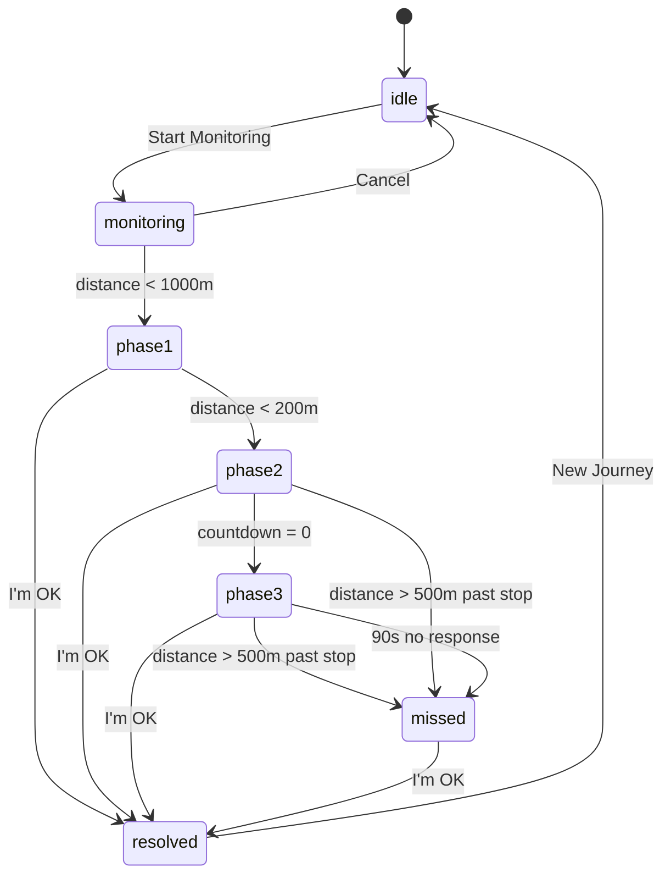
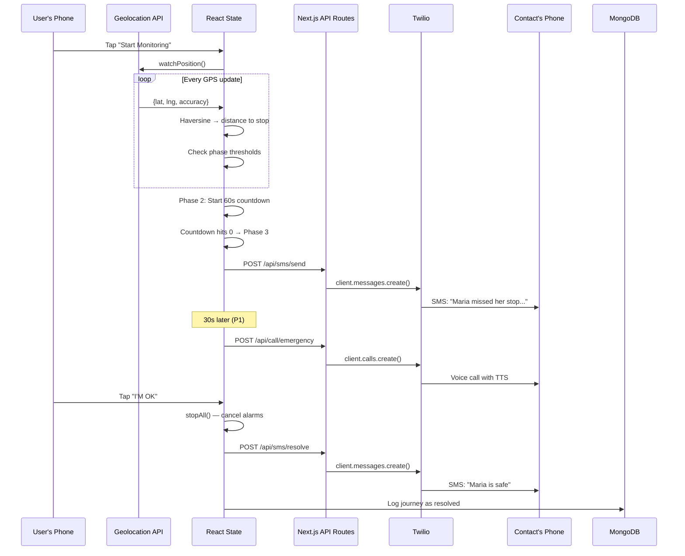

# STRUCTURE.md — Folder & File Structure

> **Status**: DRAFT — Awaiting human review and approval  
> **Last updated**: 2026-03-28  
> **Stack**: Next.js 14 (App Router) + React 18 + Vanilla CSS + MongoDB

---

## 1. Top-Level Overview

```
nudge-1/
├── app/                    # Next.js App Router — pages and API routes
│   ├── layout.js           # Root layout: global CSS, fonts, metadata
│   ├── page.js             # Screen 1: Landing page
│   ├── globals.css         # Global styles + CSS design tokens
│   ├── journey/
│   │   ├── setup/
│   │   │   └── page.js     # Screen 2: Set Journey (stop search + contacts)
│   │   ├── active/
│   │   │   └── page.js     # Screen 3: Journey Active (monitoring)
│   │   └── layout.js       # Shared journey layout wrapper
│   ├── alarm/
│   │   ├── warning/
│   │   │   └── page.js     # Screen 4: Alarm Firing (60s countdown)
│   │   └── shouting/
│   │       └── page.js     # Screen 5: Shouting Phase (full red)
│   ├── recovery/
│   │   └── page.js         # Screen 6: Missed Stop Recovery
│   ├── contacts/
│   │   └── page.js         # Screen 7: Emergency Contact Setup
│   ├── onboarding/
│   │   └── page.js         # Screen 8: Onboarding
│   └── api/
│       ├── sms/
│       │   ├── send/
│       │   │   └── route.js    # POST: Send emergency SMS via Twilio
│       │   └── resolve/
│       │       └── route.js    # POST: Send "I'm OK" resolution SMS
│       ├── call/
│       │   └── emergency/
│       │       └── route.js    # POST: Trigger Twilio voice call
│       ├── directions/
│       │   └── route.js        # GET: Proxy Google Directions API
│       └── places/
│           └── route.js        # GET: Proxy Google Places API (safe spots)
│
├── components/             # Reusable React components
│   ├── journey/
│   │   ├── StopSearch.js       # Autocomplete stop search input
│   │   ├── StopCard.js         # Selected stop display card
│   │   ├── DistanceDisplay.js  # Live km + minutes remaining
│   │   ├── GpsIndicator.js     # GPS status: active / dead reckoning / no signal
│   │   └── MonitoringPulse.js  # Subtle pulsing animation during active monitoring
│   ├── alarm/
│   │   ├── PhaseOneOverlay.js  # Yellow warning overlay
│   │   ├── PhaseTwoTakeover.js # Red full-screen with countdown
│   │   ├── PhaseThreeTakeover.js # Bright red pulsing with "PLEASE WAKE UP"
│   │   ├── CountdownTimer.js   # 60-second countdown display
│   │   └── DismissButton.js    # Giant "I'M AWAKE" button
│   ├── recovery/
│   │   ├── RouteCard.js        # Step-by-step transit rerouting
│   │   ├── SafeSpotCard.js     # Nearest 24h venue card
│   │   ├── RideshareButton.js  # One-tap Uber/Grab deep-link
│   │   └── MapLinkButton.js    # Open in Google Maps button
│   ├── contacts/
│   │   ├── ContactForm.js      # Add/edit emergency contact
│   │   ├── ContactList.js      # List of saved contacts
│   │   └── SmsPreview.js       # Preview of the SMS they'll receive
│   └── common/
│       ├── Button.js           # Reusable button (primary, danger, ghost)
│       ├── Header.js           # App header with back navigation
│       ├── StatusBanner.js     # "Emergency contact notified" banner
│       └── LoadingSpinner.js   # Loading state indicator
│
├── lib/                    # Core logic — no React, pure JS
│   ├── gps.js              # watchPosition wrapper, Haversine formula, distance calc
│   ├── alarm.js            # Web Audio API alarm, SpeechSynthesis, Vibration patterns
│   ├── wakeLock.js         # Screen Wake Lock API wrapper
│   ├── deadReckoning.js    # Accelerometer-based position estimation (P1)
│   ├── haversine.js        # Haversine distance formula (pure math)
│   ├── constants.js        # All thresholds: 200m, 500m, 60s, 4.5s, etc.
│   └── formatters.js       # Distance/time display formatting
│
├── hooks/                  # React custom hooks
│   ├── useGPS.js           # Hook wrapping lib/gps.js with React state
│   ├── useAlarm.js         # Hook managing alarm phases and escalation
│   ├── useContacts.js      # Hook for CRUD on emergency contacts
│   └── useJourney.js       # Master hook: journey state machine
│
├── models/                 # MongoDB document shapes (used by API routes)
│   ├── contact.js          # Contact schema + CRUD helpers
│   ├── journey.js          # Journey log schema
│   ├── stop.js             # Transit stop schema
│   └── venue.js            # Safe venue schema
│
├── data/                   # Seed data for demo
│   ├── stops.json          # Pre-loaded transit stops (Manila LRT/bus)
│   └── venues.json         # Pre-loaded 24h safe venues near demo route
│
├── public/                 # Static assets
│   ├── alarm.mp3           # Fallback alarm sound file
│   ├── favicon.ico         # App icon
│   ├── icon-192.png        # PWA icon
│   ├── icon-512.png        # PWA icon large
│   ├── manifest.json       # PWA manifest
│   └── sw.js               # Service Worker (minimal — cache static assets)
│
├── styles/                 # Component-specific CSS modules
│   ├── landing.module.css
│   ├── journey.module.css
│   ├── alarm.module.css
│   ├── recovery.module.css
│   ├── contacts.module.css
│   └── onboarding.module.css
│
├── .env.local              # Environment variables (git-ignored)
├── .gitignore
├── next.config.js          # Next.js configuration
├── package.json
├── jsconfig.json           # Path aliases (@/components, @/lib, etc.)
└── README.md
```

---

## 2. File Responsibilities (Key Files)

### Pages (App Router)

| File | Screen | Responsibility |
|------|--------|---------------|
| `app/page.js` | Landing | App name, tagline, 4 feature bullets, "Get Started" button → navigates to `/journey/setup` |
| `app/journey/setup/page.js` | Set Journey | Stop search with autocomplete, emergency contacts section, "Start Monitoring" button |
| `app/journey/active/page.js` | Journey Active | GPS indicator, distance display, ETA, cancel button. Triggers alarm navigation at thresholds |
| `app/alarm/warning/page.js` | Alarm Firing | Full-screen red, "YOUR STOP" heading, 60s countdown, "I'M AWAKE" button |
| `app/alarm/shouting/page.js` | Shouting Phase | Bright red pulsing, "PLEASE WAKE UP", contact notification status, giant dismiss button |
| `app/recovery/page.js` | Missed Stop | Rerouting card, safe spot card, rideshare button, Google Maps link, "Set New Alarm" |
| `app/contacts/page.js` | Contact Setup | Add up to 3 contacts, SMS preview, test SMS button |
| `app/onboarding/page.js` | Onboarding | Language selector, permission requests (location, notifications) |

### API Routes

| File | Method | Responsibility |
|------|--------|---------------|
| `app/api/sms/send/route.js` | POST | Sends emergency SMS via Twilio. Body: `{ to, userName, stopName, mapLink }` |
| `app/api/sms/resolve/route.js` | POST | Sends resolution SMS via Twilio. Body: `{ to, userName }` |
| `app/api/call/emergency/route.js` | POST | Triggers Twilio voice call with TwiML `<Say>`. Body: `{ to, userName, stopName }` |
| `app/api/directions/route.js` | GET | Proxies Google Directions API. Query: `?origin=lat,lng&destination=lat,lng` |
| `app/api/places/route.js` | GET | Proxies Google Places Nearby Search. Query: `?lat=x&lng=y&type=restaurant` |

### Core Logic (lib/)

| File | Responsibility |
|------|---------------|
| `lib/gps.js` | Wraps `navigator.geolocation.watchPosition()`. Exports `startTracking(onUpdate, onError)` and `stopTracking()`. Calls Haversine on every update. |
| `lib/haversine.js` | Pure function: `haversine(lat1, lng1, lat2, lng2) → distanceInMeters`. Used by GPS and missed stop detection. |
| `lib/alarm.js` | Three functions: `playPhaseOne()` (vibration), `playPhaseTwo()` (Web Audio alarm loop), `playPhaseThree()` (SpeechSynthesis shout loop). Plus `stopAll()`. |
| `lib/wakeLock.js` | `requestWakeLock()` and `releaseWakeLock()`. Handles visibility change re-acquisition. |
| `lib/deadReckoning.js` | Subscribes to `DeviceMotionEvent`. Estimates displacement when GPS unavailable. Returns estimated lat/lng. |
| `lib/constants.js` | All magic numbers in one place: `PHASE_1_DISTANCE: 1000`, `PHASE_2_DISTANCE: 200`, `MISSED_DISTANCE: 500`, `COUNTDOWN_SECONDS: 60`, `SHOUT_INTERVAL: 4500` |
| `lib/formatters.js` | `formatDistance(meters)` → "1.2 km" or "340 m". `formatETA(seconds)` → "3 min". |

### React Hooks (hooks/)

| File | Responsibility |
|------|---------------|
| `hooks/useGPS.js` | Returns `{ position, distance, accuracy, isTracking, error }`. Starts/stops GPS via `lib/gps.js`. |
| `hooks/useAlarm.js` | Returns `{ phase, countdown, dismiss() }`. Manages phase escalation based on distance. Calls `lib/alarm.js`. |
| `hooks/useContacts.js` | Returns `{ contacts, addContact, removeContact, sendTestSms }`. CRUD against MongoDB via API. |
| `hooks/useJourney.js` | **Master hook**. State machine: `idle → monitoring → phase1 → phase2 → phase3 → missed → resolved`. Orchestrates GPS + Alarm + SMS. |

### Journey State Machine



---

## 3. Data Flow



---

## 4. What Stitch Generates vs What Claude Builds

| Component | Built By | Notes |
|-----------|----------|-------|
| All 8 screen **layouts and visual design** | **Stitch** | Generated via `generate_screen_from_text`, exported via `react-components` skill |
| **Design system** (colors, fonts, spacing) | **Stitch** | Created via `create_design_system` MCP tool |
| CSS fine-tuning for mobile viewport | **Claude** | Stitch outputs may need 375px adjustments |
| `lib/` core logic (GPS, alarm, Haversine) | **Claude** | Pure JavaScript, no UI |
| `hooks/` React state management | **Claude** | Wires lib/ to React components |
| API routes (Twilio, Google Maps proxy) | **Claude** | Server-side Node.js |
| MongoDB models and seed data | **Claude** | Via MongoDB MCP |
| Component interactivity (onClick, state changes) | **Claude** | Stitch gives static UI; Claude adds behavior |
| Integration testing | **Claude** | End-to-end flow verification |

---

## 5. Open Questions

> [!IMPORTANT]
> **Before proceeding to SCREENS.md:**

1. **File structure OK?** Any folders you'd reorganize or rename?
2. **CSS approach**: I'm using CSS Modules (`.module.css`) per screen. OK, or prefer a single giant CSS file?
3. **State management**: Using React hooks + context only (no Redux/Zustand). Simple enough for 8 screens. Agree?
4. **PWA**: I included a basic `manifest.json` and `sw.js`. Want full PWA installability, or just enough for the demo?
